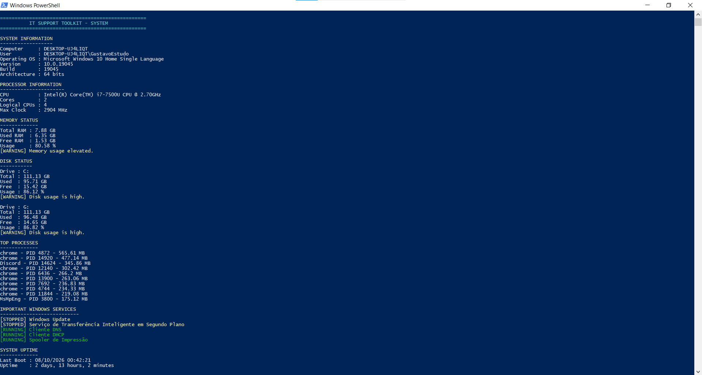
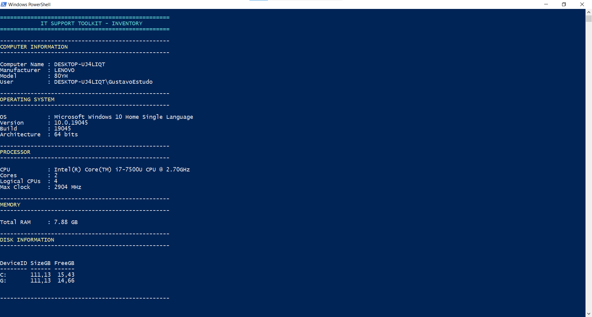
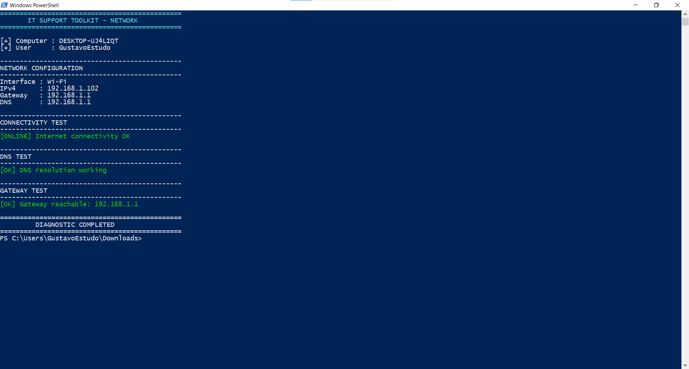
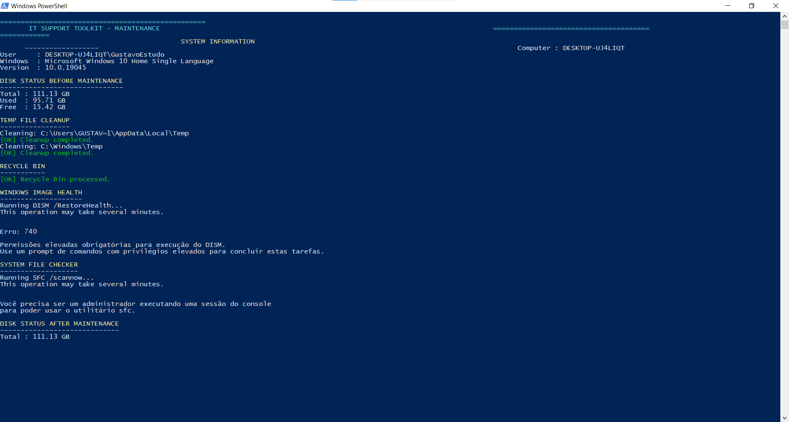

# 🛠️ IT Support Toolkit


Toolkit desenvolvido em PowerShell para auxiliar profissionais de **Suporte Técnico, Help Desk e Infraestrutura de TI** na identificação, diagnóstico e manutenção de estações Windows.

O projeto simula ferramentas utilizadas em rotinas reais de suporte técnico, automatizando tarefas que normalmente exigiriam diversos comandos manuais.

---

## 🎯 Objetivo

Criar uma ferramenta simples e prática para realizar diagnósticos básicos de uma estação Windows.

O projeto foi desenvolvido com foco em:

- Suporte N1/N2
- Help Desk
- Infraestrutura
- Troubleshooting
- Inventário de ativos
- Diagnóstico de rede
- Manutenção preventiva
- Automação com PowerShell

---

# 🔧 Ferramentas

## 🖥️ System Diagnostic

Arquivo:

` sistema.ps1 `

Realiza diagnóstico da estação Windows.

### Recursos

- Identificação do computador
- Usuário logado
- Sistema operacional
- Versão e Build do Windows
- Informações da CPU
- Núcleos e processadores lógicos
- Memória RAM
- Utilização de discos
- Processos que mais consomem memória
- Status de serviços importantes
- Uptime do sistema
- Adaptadores de rede

### Screenshot



---

# 📦 IT Asset Inventory

Arquivo:

` inventario.ps1 `

Ferramenta para coleta de informações do equipamento.

### Informações coletadas

- Nome do computador
- Usuário
- Sistema operacional
- CPU
- Memória RAM
- Discos
- Informações de hardware
- Informações básicas do sistema

### Screenshot



---

# 🌐 Network Diagnostic

Arquivo:

` network.ps1 `

Ferramenta para diagnóstico de conectividade.

### Objetivo

Facilitar o troubleshooting de problemas relacionados à rede.

### Diagnósticos

- Endereço IP
- Gateway
- DNS
- Adaptadores
- Conectividade
- Ping
- Testes de comunicação

### Screenshot



---

# 🛠️ Windows Maintenance

Arquivo:

` manutencao.ps1 `

Script para manutenção preventiva da estação Windows.

### Recursos

- Limpeza de arquivos temporários
- Limpeza da Lixeira
- Verificação do espaço em disco
- DISM
- SFC
- Verificação da integridade do sistema
- Comparação do espaço antes e depois da manutenção

### Screenshot



---

# 🧰 Tecnologias utilizadas

- PowerShell
- Windows Management Instrumentation
- CIM
- Windows Services
- Networking
- DISM
- System File Checker
- Windows Administration

---

# 📚 Conceitos aplicados

Durante o desenvolvimento foram aplicados conceitos de:

- Troubleshooting
- Administração Windows
- Hardware
- Sistemas operacionais
- Redes de computadores
- Diagnóstico de incidentes
- Automação
- PowerShell scripting
- Monitoramento de recursos
- Manutenção preventiva

---

# 🚀 Como utilizar

Clone o projeto:

```powershell
git clone https://github.com/gustavoras/it-support-toolkit.git
